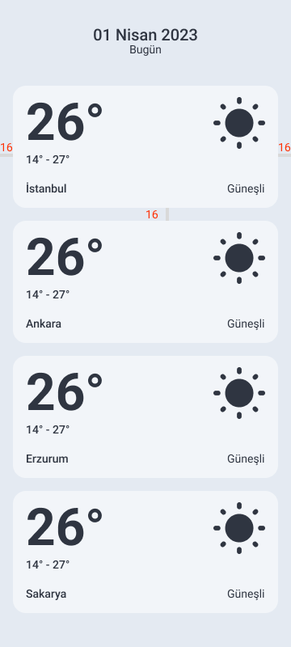
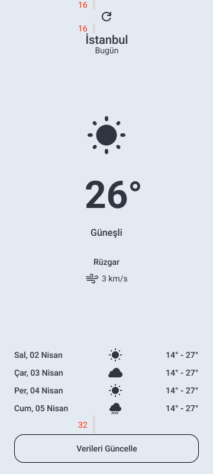

Hello,

This project focused on Android application development, including techniques for navigation and data transfer between activities and fragments. 
We designed user interfaces using ConstraintLayout and implemented data transfer with various navigation methods.

## Topic
Navigation and Data Passing Between List and Detail Screens

## Objective
After designing the given screens using ConstraintLayout and related views,
1-Activity - Activity Navigation: First, we created two separate activities. When an item in the list activity is clicked, the user is directed to the detail activity. We successfully transferred all the data from the list item to the detail activity and displayed it in the corresponding fields.
2-Fragment - Fragment Navigation: Next, we created two fragments (list and detail) under one activity. We completed the navigation by transferring data between these fragments.
3-Using Navigation Component: We integrated the Navigation Component to manage data transfer and navigation between fragments. We used SafeArgs to ensure secure data passing and facilitate navigation.
4-Fragment Result API Usage: When the refresh icon on the detail screen was clicked, a random temperature value was set in the detail fragment. Using the data update button, the Fragment Result API was employed to successfully update the temperature value in the list fragment. Upon returning, the selected temperature value was reflected in the corresponding list item.

## Technologies Used
1-ConstraintLayout: Used to arrange and position UI components.
2-Navigation Component: Used to facilitate navigation and data transfer between fragments.
3-Fragment Result API: Used to transfer data and handle updates between fragments.

## UI Design

| List            | Detail                                                               |
| ----------------- | ------------------------------------------------------------------ |
|   |  |

