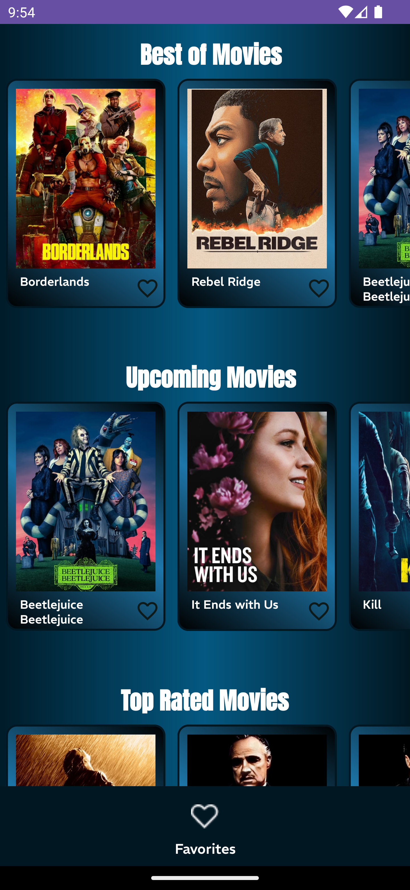

### Task-4: İnternetten Veri Çekme ve Manipülasyon

Bu görevde, internetten veri çekmeyi ve bu verileri parse ederek UI'da gösterme sürecini öğrendim. 
Seçtiğim API'dan alınan verileri liste halinde ekranda göstermeyi ve detay sayfasına gitmeyi sağladım.

## Kullanılan API:
The Movie Database API

## Yapılanlar
1-Retrofit ile Network İsteği Yapma: Retrofit kullanarak API'ya istek gönderdim ve gelen verileri aldım. API'dan çekilen bu verileri, uygulamanın UI katmanında gösterilmesi için hazırladım.
2-GSON ile Verileri Parse Etme: API'dan gelen JSON verilerini, GSON kullanarak model sınıflarına parse ettim ve veriyi uygulama içinde işlenebilir hale getirdim.
3-Liste Görüntüleme: Gelen verileri RecyclerView ile liste halinde ekranda gösterdim. UI'daki performansı artırmak için ViewHolder ve Adapter sınıflarını kullandım.
4-Detay Sayfası: Listeden bir öğeye tıkladığımda, seçilen öğeye ait detayları göstermek üzere bir detay sayfasına yönlendirme gerçekleştirdim. Fragmentlar arası veri geçişini Jetpack Navigation ile sağladım.

## Kullanılan Teknolojiler
1-Retrofit: Network istekleri için kullanıldı.
2-GSON: JSON verilerini parse etmek için kullanıldı.
3-Glide: API'dan çekilen görselleri yüklemek için kullanıldı.
4-LiveData: Veri akışını yönetmek ve UI state'ini güncellemek için kullanıldı.
5-Jetpack Navigation: Fragmentlar arası geçiş ve veri iletimi için kullanıldı.

## UI Tasarım

| List            | Detail                                                     | Favorites                |
| ----------------- | ---------------------------------------------------------|-------------------------|
|   |  | 

