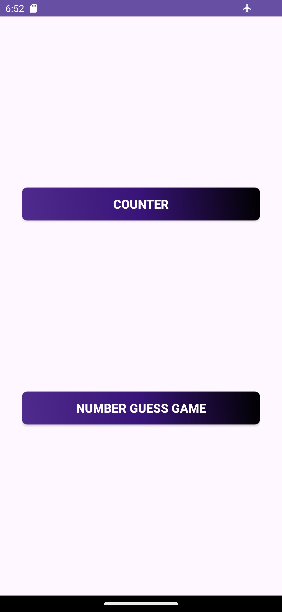
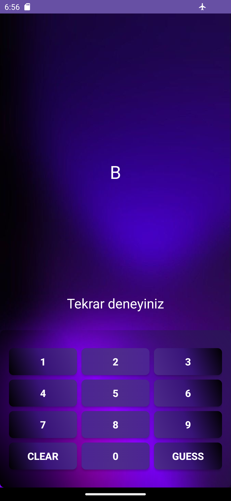
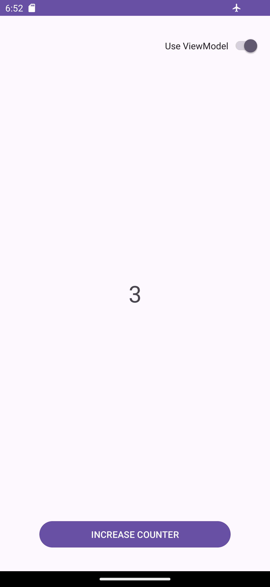

Hello,

In Task-3, I learned about Android Jetpack Architecture components, ViewModel, and LiveData. Here's what I did in this task:

1-ViewModel, Fragment, and Lifecycle Concepts: First, I learned about ViewModel, Fragment, and Activity lifecycles. I understood how ViewModel integrates with Fragments and Activities, and its responsibility for managing UI data alongside UI controllers (Activity, Fragment). I also explored how to retain data during configuration changes (e.g., device rotation).

2-Creating a New Fragment and ViewModel: I created a new fragment and associated ViewModel. I added a TextView that holds a counter value and a button to the fragment. Initially, the counter value was zero, and I set it to increment every time the button was clicked. I observed that the value stored in the ViewModel was retained even when the device was rotated.

3-Number Guessing Game: Then, I developed a number guessing game. In this game, a random number and a corresponding character were generated when the ViewModel was created. The user selected a number they guessed and clicked the "Guess" button to compare the guessed number with the randomly generated number. If correct, "You won" was displayed; otherwise, "Try again" was shown. I also tested whether the UI state was preserved by rotating the device.

4-Detail Fragment and SharedViewModel: I also created a Detail Fragment to display the hidden number, and transferred data to this fragment using a shared ViewModel. When the hidden number was clicked, I directed the user to the Detail Fragment and shared data between the two fragments using SharedViewModel. I researched the scope of SharedViewModel and compared it with other shared ViewModel scopes.

## Technologies Used:
1-ViewModel: Used to retain UI state and enable data sharing between fragments.

2-LiveData & MutableLiveData: Used to make data observable and create a lifecycle-aware structure.

3-Fragment: Used for UI management and fragment transitions.

4-Navigation Component: Used for data transfer and navigation between fragments.

5-SharedViewModel: Used to facilitate data sharing at the activity level.

## UI Design
 
| Giriş            | Number Guess Game            | Counter            |
| ----------------- | ------------------------------------------------------------------ |------------------------------------------------------------------ |
|   |  |  |

