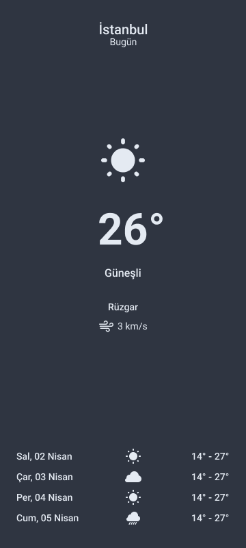

Merhaba,

Bu proje, Android uygulama geliştirme sürecinde ConstraintLayout kullanarak UI tasarımını nasıl yapabileceğinizi gösterir. 
Tasarım aşamasında, Light ve Dark mod seçenekleriyle kullanıcı arayüzlerini oluşturduk.

## Konu 
ConstraintLayout ile UI tasarlama

## UI Tasarım

| Light Mode             | Dark Mode                                                                |
| ----------------- | ------------------------------------------------------------------ |
|   |  |

